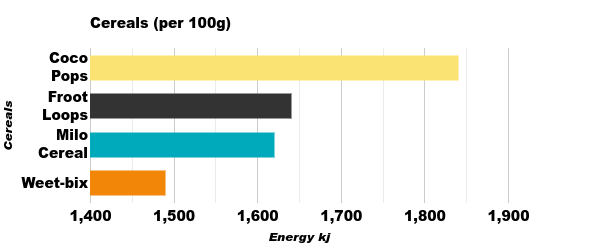

# Math Investigation (Y7 T4)

### Table of contents
+ [Milo Cereal](#milo-cereal-nutrition-chart)
+ [Coco Pops](#coco-pops-nutrition-chart)
+ [Weet-bix](#weet-bix-nutrition-chart)
+ [Froot Loops](#froot-loops-nutrition-chart)
+ [Tables](#tables)

In this report, I will study the nutrition facts of the cereals I have chosen: Coco Pops, Froot Loops, Milo Cereal and Weetbix. Then I will ask questions: Which cereal is the healthiest? Which has the most sodium (salt)? After that, I will explain why I chose that question. Next, I will analyse the nutrition data and compare them. Some nutrition facts are Energy, Protein, Sugar (Natural and Artificial), Sodium and Fats. Then I will draw a table to show the information per 100g for all cereals. I will collate the data from the four tables into one table. Then, I will answer the following question, "Think of the different types of graphs used to represent data in statistics. Say why you chose the type of graph you did. Explain clearly why this is a more appropriate graph than other types." Finally, I will present my work to Mr Lotsos.

## Nutrition Charts
### Milo Cereal Nutrition Chart

### Coco Pops Nutrition Chart

### Weet-bix Nutrition Chart

### Froot Loops Nutrition Chart

## Tables

## Charts

.png)
.png)
.png)
.png)
.png)
.png)